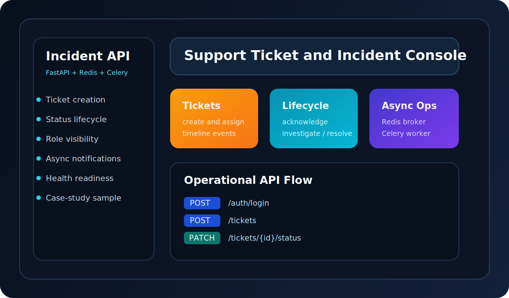

# incident-management-api

Backend repair case study built around a small incident-management API. The repository includes the runnable sample service, a sanitized write-up of the repair work, and a recreated before/after sample that shows the debugging approach without exposing any confidential code.



## Feature list

- JWT login and role-based incident visibility
- Ticket creation, assignment, and status transitions
- Redis and Celery integration for async notification delivery
- Liveness and readiness health checks
- Backend repair write-up covering problem, investigation, change, and result
- Sanitized recreated sample of the repaired notification pipeline

## Stack

- Python 3.11
- FastAPI
- SQLAlchemy
- JWT authentication
- Redis
- Celery
- Docker Compose

## Setup instructions

```bash
copy .env.example .env
docker compose --profile infra up --build api redis worker
```

Open:

- `http://localhost:8002/` for the browser landing page
- `http://localhost:8002/docs` for Swagger docs
- `http://localhost:8002/health/ready` for readiness status
- Docker Compose health checks cover the API, Redis, and optional PostgreSQL services

### Tests

```bash
python -m unittest discover -s tests
python recreated_sample/test_notification_pipeline.py
```

The repository includes a GitHub Actions workflow at `.github/workflows/ci.yml` that runs policy tests and the recreated case-study sample on every push.

Demo credentials:

- `admin@example.com` / `ChangeMe123!`
- `agent@example.com` / `ChangeMe123!`
- `reporter@example.com` / `ChangeMe123!`

## Sample API endpoints

- `POST /auth/login` issues a JWT access token
- `GET /tickets` returns incidents visible to the authenticated user
- `POST /tickets` creates a new support or incident ticket
- `PATCH /tickets/{ticket_id}/status` updates lifecycle state and writes a timeline event
- `GET /health/ready` reports database and Redis readiness

## Case study

See [docs/case-study.md](docs/case-study.md) for the repair write-up. It covers:

- the original notification-delivery problem
- how the issue was investigated
- the code and configuration changes that fixed it
- the final result and operating behavior

The recreated sample lives in [recreated_sample/README.md](recreated_sample/README.md) and demonstrates the same repair pattern in a stripped-down form.

## Monitoring notes

Operational follow-through is documented in [docs/monitoring.md](docs/monitoring.md).
